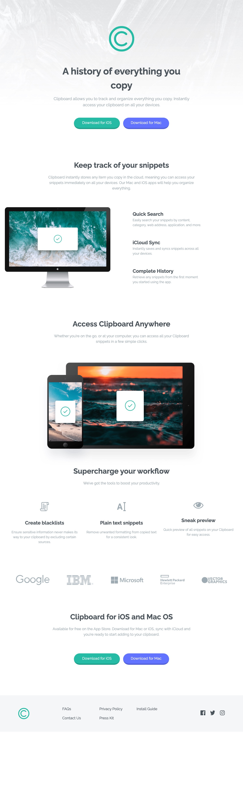
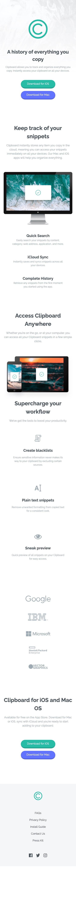

# Clipboard Landing Page

A static single-view landing page promoting **Clipboard**, a fictional clipboard-manager app. Meant as a practice project and a reference for anyone reading or extending the code.

## Demo

- **Live:** https://clipboard-landing-page-tau-ecru.vercel.app/

| Desktop                                            | Mobile                                                       |
| ------------------------------------------------- | ---------------------------------------------------------- |
|  |  |

## Stack


## Features

- Whole page composed in a single component tree in [src/App.tsx](src/App.tsx): header, download buttons, text sections, features, devices, info block and logos.
- Reusable `Section` component driven by `title` and `content` props ([src/components/section/index.tsx](src/components/section/index.tsx)); used 4 times in `App.tsx`.
- `Button` component with `primary` / `secondary` variants that also forwards native `<button>` props ([src/components/form/button/index.tsx](src/components/form/button/index.tsx)).
- Footer links and social icons defined as data, not JSX, in [src/common/data/footer.ts](src/common/data/footer.ts) and typed with `Links` and `Social` ([src/common/interfaces/footer.ts](src/common/interfaces/footer.ts)).
- Styling via per-component SCSS CSS Modules (10 `*.module.scss` files) plus a global token layer (colors, breakpoints, mixins) reachable through the `@styles` alias ([vite.config.ts](vite.config.ts), [tsconfig.app.json](tsconfig.app.json)).
- No client state, no router, no network calls: every component is a pure function of its props.
- Strict TypeScript with `noUnusedLocals` and `noUnusedParameters` ([tsconfig.app.json](tsconfig.app.json)).
- Automated quality: ESLint flat config with type-checked rules, Prettier, a pre-commit hook and GitHub Actions CI.

## Prerequisites

| Tool    | Version              | Source                                                                                         |
| ------- | -------------------- | ---------------------------------------------------------------------------------------------- |
| Node.js | `>= 22` (CI uses 24) | [package.json](package.json) → `engines`, [.github/workflows/ci.yml](.github/workflows/ci.yml) |
| Yarn    | 1.x (Classic)        | [yarn.lock](yarn.lock) (`lockfile v1`)                                                         |

## Quick start

```bash
git clone git@github.com:EdouardoCornejo/clipboard-landing-page.git
cd clipboard-landing-page
yarn install
yarn dev
```

Vite serves the app at `http://localhost:5173`.

## Available scripts

Defined in [package.json](package.json).

| Script              | Actual command                                                 | What it does                                                              |
| ------------------- | -------------------------------------------------------------- | ------------------------------------------------------------------------- |
| `yarn dev`          | `vite`                                                         | Development server with HMR.                                              |
| `yarn build`        | `tsc -b && vite build`                                         | Type-checks with TypeScript and produces the production build in `dist/`. |
| `yarn preview`      | `vite preview`                                                 | Serves the already-built `dist/` output locally.                          |
| `yarn lint`         | `eslint . --report-unused-disable-directives --max-warnings 0` | Lints the whole repo; fails on any warning or unused `eslint-disable`.    |
| `yarn format:fix`   | `prettier --write .`                                           | Formats every file in the repo.                                           |
| `yarn format:check` | `prettier --check .`                                           | Checks formatting without writing. Used by CI.                            |
| `yarn prepare`      | `husky`                                                        | Installs the Git hooks. Runs automatically after `yarn install`.          |

## Architecture

Static single-page app with no state. [src/main.tsx](src/main.tsx) mounts `<App />` in `<StrictMode>`, and [src/App.tsx](src/App.tsx) builds the whole page by arranging presentational components inside `PageLayout`. Text is passed as props (`Section`, `Button`); the only variable data — footer links and socials — lives as arrays in [src/common/data/footer.ts](src/common/data/footer.ts). Each component is a folder with an `index.tsx` and its `*.module.scss` next to it, all re-exported from [src/components/index.ts](src/components/index.ts). Global styles (reset, fonts, colors, breakpoints, mixins) load via `@import '@styles'`, an alias resolving to [src/styles/index.scss](src/styles/index.scss).

## Extending

### Add a new visual block to the page

Touches 4 places (5 if it uses images):

1. Create `src/components/myBlock/index.tsx` with `export const MyBlock = () => { ... }`.
2. Create `src/components/myBlock/my-block.module.scss`, starting it with `@import '@styles';` if you need the tokens.
3. Add `export * from './myBlock';` to [src/components/index.ts](src/components/index.ts).
4. Import `MyBlock` and place it where it belongs in [src/App.tsx](src/App.tsx).
5. If it has images, put them in [src/assets/](src/assets/) and import them from the block's `index.tsx` (see [src/components/features/index.tsx](src/components/features/index.tsx)).

### Add a text section

Reuse `Section`; touches 1 place:

```tsx
// src/App.tsx
<Section title="Your title" content="Your text." />
```

### Add a footer link or social icon

Touches 1 place (2 for a new social with an icon):

1. Add an object to `linksData` or `socialData` in [src/common/data/footer.ts](src/common/data/footer.ts), with a unique `id`.
2. For a social icon, save the SVG in [src/assets/svg/](src/assets/svg/) and import it as the `icon` value.

The footer maps over those arrays and renders the items on its own ([src/components/layout/footer/index.tsx](src/components/layout/footer/index.tsx)).

## Quality

- **Lint:** `yarn lint`. Flat config in [eslint.config.js](eslint.config.js): `@eslint/js` recommended, `typescript-eslint` type-checked, React Hooks and React Refresh rules, `enum` and `namespace` banned, separate type imports, zero warnings allowed.
- **Formatting:** Prettier with [.prettierrc.json](.prettierrc.json) (`printWidth: 100`, single quotes, `trailingComma: all`). Use `yarn format:fix` to write and `yarn format:check` to verify.
- **Pre-commit:** [.husky/pre-commit](.husky/pre-commit) runs `lint-staged` (ESLint `--fix` + Prettier on staged files) and then `yarn build`. The `lint-staged` config is in [package.json](package.json).
- **CI:** [.github/workflows/ci.yml](.github/workflows/ci.yml) runs on every push and pull request to `main` on Node 24, in the sequence `format:check` → `lint` → `build`. It only verifies; it never deploys.
- **Deploy:** [vercel.json](vercel.json) disables Git auto-deploy (`deploymentEnabled: false`); deployment to Vercel is triggered manually.

## Contributing

1. Branch off `main`.
2. Make commits that pass the pre-commit hook (lint, formatting and build all green).
3. Open a pull request against `main` and wait for CI to pass.

## License

No explicit license. Personal practice project based on the [Frontend Mentor Clipboard landing page challenge](https://www.frontendmentor.io/challenges/clipboard-landing-page-5cc9bccd6c4c91111378ecb9); the design and assets belong to Frontend Mentor. All rights reserved unless stated otherwise.
